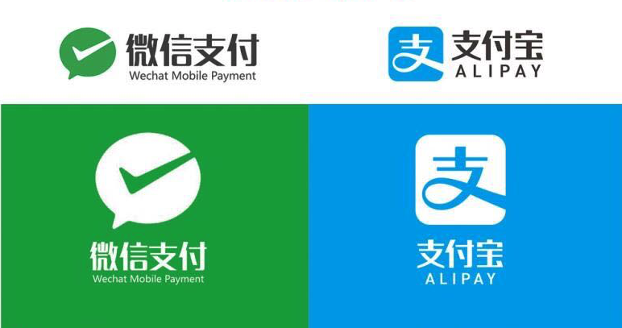

#	XHPayKit 
##	不用官方SDK,实现微信支付、支付宝支付

[](https://github.com/CoderZhuXH/XHPayKit)
[](http://cocoadocs.org/docsets/XHPayKit)
[](https://github.com/CoderZhuXH/XHPayKit)
[](http://cocoadocs.org/docsets/XHPayKit/)
[](https://github.com/CoderZhuXH/XHPayKit/blob/master/LICENSE)



### 技术交流群(群号:537476189)


##  温馨提示
1.使用XHPayKit走不通支付流程的,基本都是所传支付参数有问题,建议你先使用官方SDK调通支付流程后,再删除官方SDK使用XHPaykit.<br>
2.XHPaykit和官方SDK有类似接口,可以实现快速替换.

##	写在最前

1.此库拥有和官方SDK相似的接口,可以直接替换官方SDK支付接口,如果你使用过官方SDK,那么转换为本库你只需花费极短时间<br>
2.此库只有10kb大小,不用导入任何依赖库,便可实现微信支付、支付宝支付,如果你想为项目瘦身或由于某种原因,不想使用官方SDK实现支付功能,此库将是一个不错的选择.<br>
3.本库使用时,不需要配置微信等平台appid等信息,服务端配置就可以了,支付不同于登录分享,参数均由后台生成,后台签名订单时会返回appid等信息给客户端.

## 如果你不想让审核人员扫描到APP里面的支付功能[请看这里>>>](https://github.com/CoderZhuXH/XHPayKit/blob/master/审核防检测到支付功能版本/README.md)

###	注意:
1.先在微信、支付宝开放平台注册你的应用,并获得支付能力<br>
2.导入此库,并请将 weixin 、 alipay 字段添加到info.plist白名单<br>
3.并添加两个URL Schemes 如图:<br>

4.XHPayKit在未安装支付宝/微信情况下,不会拉起网页支付<br>


### 运行Demo注意事项:
由于demo拉起支付时,未传递真实支付参数,所以并不能真正进行支付,请替换为真实订单参数即可(这些参数由后台进行订单签名时生成并返回给客户端).

##	代码示例

###	1.微信支付

//以下参数详细介绍见微信官方文档:<https://pay.weixin.qq.com/wiki/doc/api/app/app.php?chapter=9_12&index=2>

```objc

//微信支付参数,下面7个参数,由后台签名订单后生成,并返回给客服端(与官方SDK一致)
//注意:请将下面参数设置为你自己真实订单签名后服务器返回参数,便可进行实际支付

XHPayWxReq *req = [[XHPayWxReq alloc] init];
req.openID = @"";//微信开放平台审核通过的应用APPID
req.partnerId = @"";//商户号
req.prepayId = @"";//交易会话ID
req.nonceStr = @"";//随机串，防重发
req.timeStamp = 1518156229;//时间戳，防重发
req.package = @"";// 扩展字段,暂填写固定值Sign=WXPay
req.sign = @"";//签名
        
//传入订单模型,拉起微信支付
[[XHPayKit defaultManager] wxpayOrder:req completed:^(NSDictionary *resultDict) {
      NSLog(@"支付结果:\n%@",resultDict);
      NSInteger code = [resultDict[@"errCode"] integerValue];
      if(code == 0){//支付成功
                
      }
}];

        
```

###	2.支付宝支付
```objc

//支付宝订单签名,此签名由后台签名订单后生成,并返回给客户端(与官方SDK一致)
//注意:请将下面值设置为你自己真实订单签名,便可进行实际支付
NSString *orderSign = @"很长的一串支付宝订单签名";
        
//传入支付宝订单签名 和 自己App URL Scheme,拉起支付宝支付
[[XHPayKit defaultManager] alipayOrder:orderSign fromScheme:@"XHPayKitExample" completed:^(NSDictionary *resultDict) {
    NSLog(@"支付结果:\n%@",resultDict);
    NSInteger status = [resultDict[@"resultStatus"] integerValue];
    if(status == 9000){//支付成功
                
    }
}];

```

###	 3.在Appdelegate中添加以下代码 - 处理第三方支付跳回商户app携带的支付结果Url

```objc
#if __IPHONE_OS_VERSION_MAX_ALLOWED >= __IPHONE_9_0
/** iOS9及以后 */
- (BOOL)application:(UIApplication *)app openURL:(NSURL *)url options:(NSDictionary<UIApplicationOpenURLOptionsKey, id> *)options
{
    BOOL result = [[XHPayKit defaultManager] handleOpenURL:url];
    if (!result) {//这里处理其他SDK(例如QQ登录,微博登录等)
        
    }
    return result;
}
#endif
/** iOS9以下 */
- (BOOL)application:(UIApplication *)application openURL:(NSURL *)url sourceApplication:(NSString *)sourceApplication annotation:(id)annotation
{
    BOOL result = [[XHPayKit defaultManager] handleOpenURL:url];
    if (!result) {//这里处理其他SDK(例如QQ登录,微博登录等)
        
    }
    return result;
}

```

##	其它接口
```objc
/**
 是否安装微信

 @return 已安装YES,未安装NO
 */
+(BOOL)isWxAppInstalled;

/**
 是否安装支付宝

 @return 已安装YES,未安装NO
 */
+(BOOL)isAliAppInstalled;

```

## 支付结果resultDict释义

### 微信

```objc
{
    "errCode":0,
    "errStr":"成功"
}

//以下状态码含义与官方SDK一致
errCode = 0,成功<br>
errCode = -1,普通错误类型<br>
errCode = -2,用户点击取消并返回<br>
errCode = -3,发送失败<br>
errCode = -4,授权失败 <br>
errCode = -5,微信不支持<br>
```

### 支付宝

```objc
{
    "result":"",
    "resultStatus":"9000",
    "memo":"支付成功"
}

//以下状态码含义与官方SDK一致
resultStatus = 9000,支付成功<br>
resultStatus = 8000,正在处理中，支付结果未知（有可能已经支付成功）,请查询商户订单列表中订单的支付状态<br>
resultStatus = 4000,支付失败<br>
resultStatus = 5000,重复请求<br>
resultStatus = 6001,用户中途取消<br>
resultStatus = 6002,网络连接出错<br>
resultStatus = 6004,支付结果未知（有可能已经支付成功），请查询商户订单列表中订单的支付状态<br>

```


##  安装
### 1.手动添加:<br>
*   1.将 XHPayKit 文件夹添加到工程目录中<br>
*   2.导入 XHPayKit.h

### 2.CocoaPods:<br>
*   1.在 Podfile 中添加 pod 'XHPayKit'<br>
*   2.执行 pod install 或 pod update<br>
*   3.导入 XHPayKit.h

###	3.Tips
*   1.如果你pod search XHPayKit 后提示:[!] Unable to find a pod with name, author, summary, or description matching `XHPayKit`,请在终端上执行 rm ~/Library/Caches/CocoaPods/search_index.json , 后重新pod search XHPayKit
*   2.如果发现pod search XHPayKit 搜索出来的不是最新版本，需要在终端执行cd ~/desktop退回到desktop，然后执行pod setup命令更新本地spec缓存（需要几分钟），然后再搜索就可以了
*   3.如果你发现你执行pod install后,导入的不是最新版本,请删除Podfile.lock文件,在执行一次 pod install
*   4.如果在使用过程中遇到BUG，希望你能Issues我，谢谢（或者尝试下载最新的代码看看BUG修复没有）

##  系统要求
*   该项目最低支持 iOS 7.0 和 Xcode 8.0

##  许可证
XHPayKit 使用 MIT 许可证，详情见 LICENSE 文件